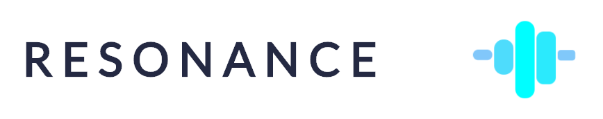
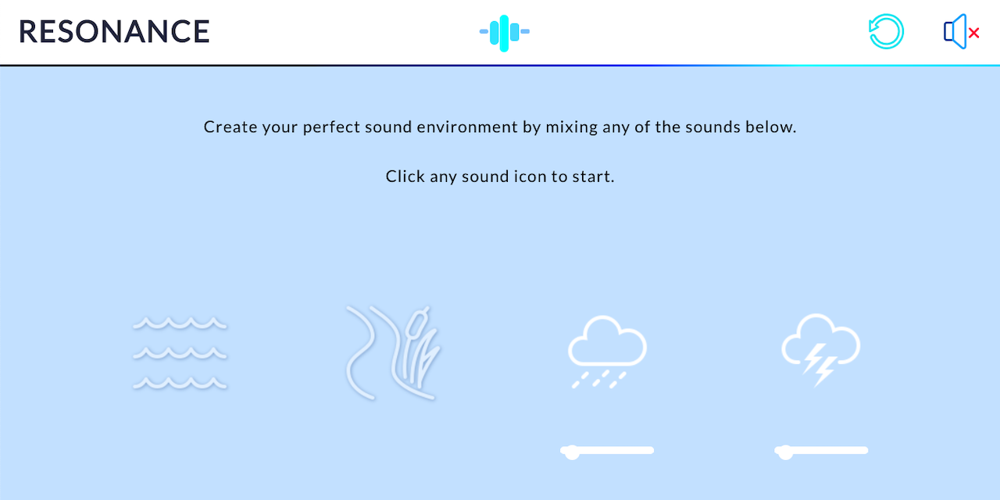

*An ambient noise mixer built with JavaScript*

  **[LIVE SITE](https://sara-ls.github.io/resonance/)**

## Description

The right background noise can help create an atmosphere that fuels your creativity and reduces stress. RESONANCE allows you to create your perfect sound environment for work, relaxing, or just to drown out your noisy neighbors.



## Technologies

- JavaScript
- Node.js
- Webpack
- Sass
- HTML5

## Highlights


- Audio visualization animation that moves only when sounds are played

```js
// Audio visualization
const visual = document.getElementById("visual");

// Adding listeners to every play/stop button
  document.querySelectorAll(".play").forEach((playBtn) => {
    playBtn.addEventListener(
      "click",
      function playSound(e) {
        // Stop/start playing a sound
        if (isMuted) muteDocument();

        let targetElement = e.target || e.srcElement;
        let outerElem = targetElement.parentElement.parentElement;
        let selectedSound = outerElem.querySelector("audio");
        let volumeControler = outerElem.querySelector(".volume-bar");
        let soundImage = outerElem.querySelector("img");

        if (selectedSound.paused) {
          // Play sound
          volumeControler.style.opacity = 1;
          selectedSound.loop = true;
          if (volumeControler.value == 0) volumeControler.value = 0.05;
          selectedSound.volume = volumeControler.value;
          selectedSound.play();
          soundImage.classList.add("playing");

          // Turn on audio visualization animation
          if (visual.classList.contains("off")) {
            visual.classList.remove("off");
          }
        } else {
          // Pause sound
          volumeControler.style.opacity = 0;
          selectedSound.pause();
          selectedSound.currentTime = 0;
          volumeControler.value = 0;
          soundImage.classList.remove("playing");
          // Check if other sounds arer still playing
          let numPlaying = document.getElementsByClassName("playing").length;
          // Turn off audio visualization animation
          if (
            (!visual.classList.contains("off") && numPlaying === 0) ||
            isMuted
          ) {
            visual.classList.add("off");
          }
        }
      },
      false
    );
  });

  // DOM elements that control sound volume
  const volumeControls = document.querySelectorAll(".volume-bar");

  // Adding listeners to every volume control slider
  for (let i = 0; i < volumeControls.length; i++) {
    volumeControls[i].addEventListener("input", volumeSound, false);
    volumeControls[i].style.opacity = 0;
  }

  // DOM element that mutes and unmutes the page
  let isMuted = false;
  document
    .querySelector(".mute-btn a")
    .addEventListener("click", muteDocument, false);

  // DOM element that resets the sounds
  document
    .querySelector(".reset-btn a")
    .addEventListener("click", resetSounds, false);

  // Volume controller
  function volumeSound(e) {
    if (isMuted) muteDocument();

    let targetElement = e.target || e.srcElement;
    let selectedSound = targetElement.parentElement.querySelector("audio");
    selectedSound.volume = targetElement.value;
  }

  let currentSounds = [];

  function muteDocument() {
    if (!isMuted) {
      isMuted = true;
      document.querySelector(".unmuted").style.display = "none";
      document.querySelector(".muted").style.display = "inline";
      let allAudio = document.querySelectorAll("audio");

      for (let i = 0; i < allAudio.length; i++) {
        if (!allAudio[i].paused) {
          currentSounds.push([allAudio[i], allAudio[i].volume]);
        }
      }
      currentSounds.forEach(function (sound) {
        sound[0].volume = 0;
      });

      // Turn off audio visual
      if (!visual.classList.contains("off")) {
        visual.classList.add("off");
      }
    } else {
      isMuted = false; // Unmute
      document.querySelector(".unmuted").style.display = "inline";
      document.querySelector(".muted").style.display = "none";
      currentSounds.forEach((sound) => (sound[0].volume = sound[1]));

      // Turn on audio visual animation if unmuting & currentSounds is not empty
      if (visual.classList.contains("off") && currentSounds.length > 0) {
        visual.classList.remove("off");
      }
    }
  }

```

- Custom cursor that responds to hovering over a clickable element

```js
// CUSTOM CURSOR
class Cursor {
  constructor() {
    this.delay = 4; // Delay cursor outline

    // Cursor outline position
    this._x = 0;
    this._y = 0;

    // Cursor dot position
    this.dotX = window.innerWidth / 2;
    this.dotY = window.innerHeight / 2;

    this.cursorVisible = true;
    this.cursorEnlarged = false;

    // Grab cursor elements
    this.dot = document.querySelector(".cursor-dot");
    this.outline = document.querySelector(".cursor-dot-outline");

    this.dotSize = this.dot.offsetWidth;
    this.outlineSize = this.outline.offsetWidth;

    this.setupEventListeners = this.setupEventListeners.bind(this);
    this.delayDotOutline = this.delayDotOutline.bind(this);
    this.toggleCursorSize = this.toggleCursorSize.bind(this);
    this.toggleCursorVisibility = this.toggleCursorVisibility.bind(this);

    this.setupEventListeners();
    this.delayDotOutline();
  }

  setupEventListeners() {
    let that = this;

    // Expand when hovering over clickable element
    document
      .querySelectorAll("a, button, input, .show-code-btn > svg")
      .forEach((aElem) => {
        aElem.addEventListener("mouseover", () => {
          that.cursorEnlarged = true;
          that.toggleCursorSize();
        });
        aElem.addEventListener("mouseout", () => {
          that.cursorEnlarged = false;
          that.toggleCursorSize();
        });
      });

    // Click events
    document.addEventListener("mousedown", () => {
      that.cursorEnlarged = true;
      that.toggleCursorSize();
    });
    document.addEventListener("mouseup", () => {
      that.cursorEnlarged = false;
      that.toggleCursorSize();
    });

    // Position the dot
    document.addEventListener("mousemove", (e) => {
      // Show the cursor
      that.cursorVisible = true;
      that.toggleCursorVisibility();

      that.dotX = e.pageX;
      that.dotY = e.pageY;
      that.dot.style.top = that.dotY + "px";
      that.dot.style.left = that.dotX + "px";
    });

    // Hide/show cursor when exiting/entering window
    document.addEventListener("mouseenter", () => {
      that.cursorVisible = true;
      that.toggleCursorVisibility();
      that.dot.style.opacity = 1;
      that.outline.style.opacity = 1;
    });
    document.addEventListener("mouseleave", () => {
      that.cursorVisible = false;
      that.toggleCursorVisibility();
      that.dot.style.opacity = 0;
      that.outline.style.opacity = 0;
    });
  }

  // Slightly delay cursor outline when moving
  delayDotOutline() {
    this._x += (this.dotX - this._x) / this.delay;
    this._y += (this.dotY - this._y) / this.delay;
    this.outline.style.top = this._y + "px";
    this.outline.style.left = this._x + "px";
    requestAnimationFrame(this.delayDotOutline.bind(this));
  }

  // Expand/contract cursor dot/outline
  toggleCursorSize() {
    if (this.cursorEnlarged) {
      this.dot.style.transform = "translate(-50%, -50%) scale(0.75)";
      this.outline.style.transform = "translate(-50%, -50%) scale(2)";
    } else {
      this.dot.style.transform = "translate(-50%, -50%) scale(1)";
      this.outline.style.transform = "translate(-50%, -50%) scale(1)";
    }
  }

  // Hide/show cursor
  toggleCursorVisibility() {
    if (this.cursorVisible) {
      this.dot.style.opacity = 1;
      this.outline.style.opacity = 1;
    } else {
      this.dot.style.opacity = 0;
      this.outline.style.opacity = 0;
    }
  }
}

document.addEventListener("DOMContentLoaded", () => {
  let cursor = new Cursor();
});
```


- Water animation that rises as audio files load

```js
// LOADING ANIMATION

// Import water pouring loading sound
const sound = new Audio(
  "https://actions.google.com/sounds/v1/water/water_drains_in_pipe.ogg"
);

document.getElementById("enter").addEventListener("click", (e) => {
// Hide enter button
e.currentTarget.style.background = "transparent";
e.currentTarget.style.border = "1px solid transparent";
e.currentTarget.innerHTML = "";
sound.play();

  // Load DOM Elements with sound
  const allAudio = document.querySelectorAll("audio");

  for (let i = 0; i < allAudio.length; i++) {
    // Attach event listener to all audio files
    // Execute loadSounds for each loaded file
    allAudio[i].addEventListener("canplaythrough", loadSounds, false);
    // Force reload in case audio files loaded, prevent stuck loading screen
    allAudio[i].load();
  }

  let loaded = 0;
  let percent = 0;

  function loadSounds(e) {
    // Increment loaded counter to check if all sounds can be played
    loaded++;
    // Calculate percent of audio files loaded
    percent = Math.floor((100 * loaded) / allAudio.length);

    document.getElementById("count").innerText = percent + "%";

    // Show water rising in loading animation
    document.getElementById("water").style.transform = `translate(0, ${
      100 - percent
    }%)`;
    // Last file loaded
    if (loaded === allAudio.length) {
      for (let i = 0; i < allAudio.length; i++) {
        allAudio[i].removeEventListener("canplaythrough", loadSounds);
      }

      sound.pause();

      // Fade out and remove load-screen once all audio loaded
      let fadeTarget = document.getElementById("load-screen");
      fadeTarget.style.opacity = 0;
      setTimeout(() => {
        document.querySelector("body").removeChild(fadeTarget);
      }, 500);
    }
  }
});

```


## Credits / Libraries

* Icons: [Icons8](https://icons8.com/), Freepik, [Flaticon](https://www.flaticon.com/)
* Sounds from [Free Sounds Library](https://www.freesoundslibrary.com/)
  [Attribution 4.0 International License](https://creativecommons.org/licenses/by/4.0/)
* CSS Reset: [normalize.css](github.com/necolas/normalize.css) 
  MIT License
* Inspired by Noisli
